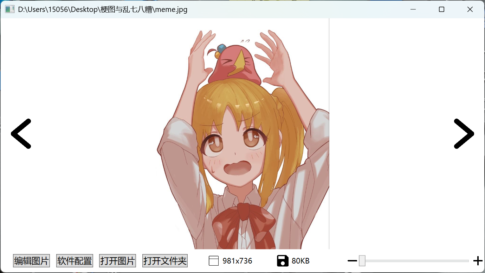
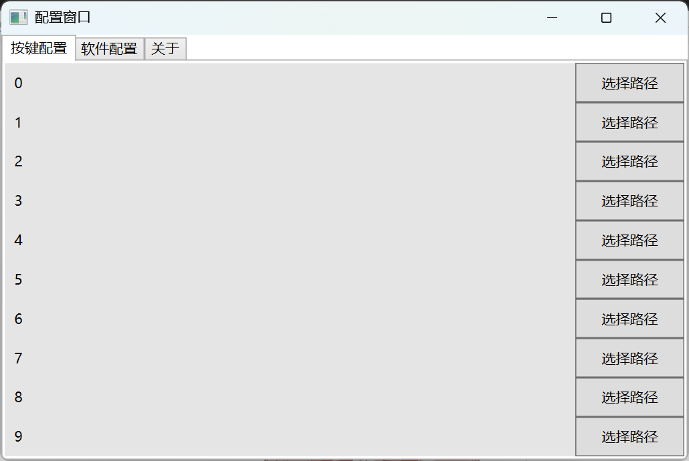
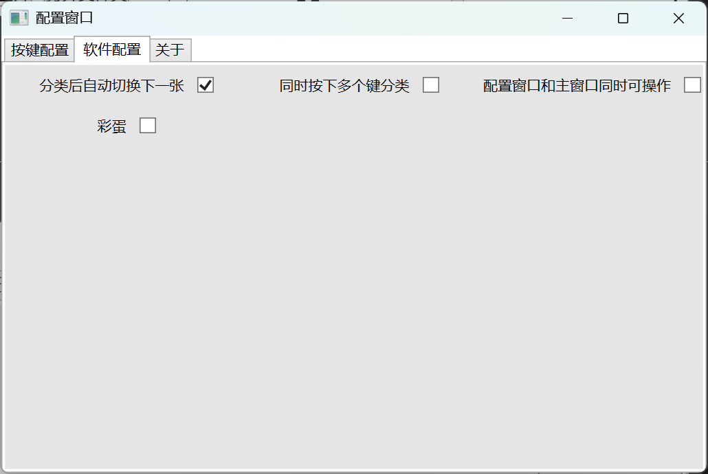

# ClassifyImage

一个手工图片分类器,可以通过快捷键把图片分类到不同的文件夹，支持裁剪图片到特定尺寸，方便深度学习样本分类使用。

## 使用方式

- 在配置中为数字 0～9 指定类别目录，打开图片或图片文件夹后按数字键分类（支持小键盘）。
- 默认单类别分类会移动图片；启用“同时按下多个键分类”后，同时按住多个数字键，全部松开时会复制到对应类别目录并保留原图。
- “分类后自动切换下一张”只切换图片；“下一张自动移动”在手动向右翻页时使用默认目录。同名文件自动添加数字后缀。
- 使用加减按钮或滑块缩放，100% 表示适应窗口，放大后可通过滚动条浏览。
- 裁剪时可拖动边框，也可输入精确的像素宽高并点击“应用尺寸”；确认后保存到原文件，Esc 或取消按钮退出裁剪。

主界面右侧显示类别目录，可以点击分类，并直接切换自动下一张和多类别模式。配置窗口中的更改会同步到主界面。

常用快捷键：`Ctrl + O` 打开图片、`Ctrl + Shift + O` 打开文件夹、`F2` 打开配置、`E` 裁剪、`Ctrl + C` 复制图片。`Ctrl + 滚轮` 缩放，点击缩放百分比恢复适应窗口。

图片放大超出显示区域后，可按住图片上的鼠标左键拖动平移；裁剪模式下拖动仍用于调整裁剪区域。

构建：`dotnet build ClassifyImage.sln`。

自动验证：`dotnet run --project tests/ClassifyImage.SmokeTests.csproj`（Windows 环境，使用临时图片，不修改用户分类配置）。

## 主界面

## 配置界面

